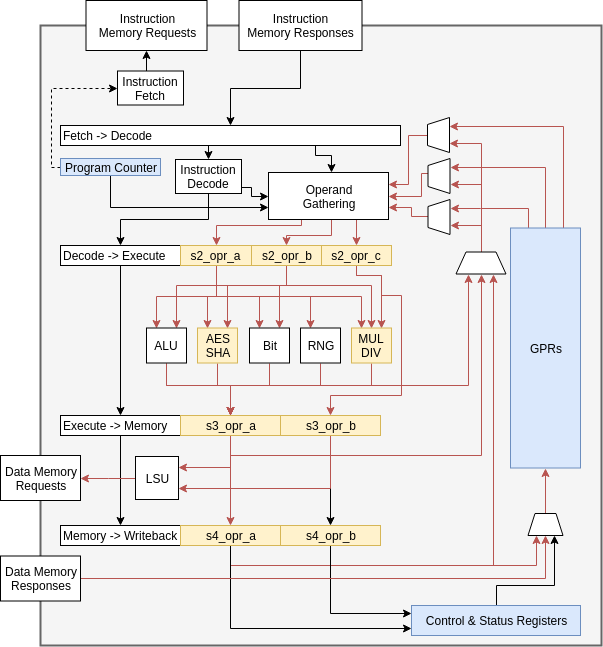

# [SCARV](https://github.com/scarv/scarv): processor core implementation 

<!--- -------------------------------------------------------------------- --->

*Acting as a component part of the wider
[SCARV](https://www.scarv.org)
project,
the
[RISC-V](https://riscv.org)
compatible SCARV micro-controller
(comprising a processor core and SoC)
is the eponymous, capstone output,
e.g., representing a demonstrator for the
[XCrypto](https://github.com/scarv/xcrypto)
ISE.
The main
[repository](https://github.com/scarv/scarv)
acts as a general container for associated resources;
this specific submodule houses
the 
processor core
implementation.*

<!--- -------------------------------------------------------------------- --->

- [Overview](#Overview)
- [Documentation](#Documentation)
- [Quickstart](#Quickstart)
- [Acknowledgements](#Acknowledgements)

## Overview

This is a 5-stage single issue in order CPU core, implementing the
RISC-V 32-bit integer base architecture, along with the **C**ompressed
and **M**ultiply extensions.
It's a micro-controller, with no cache, branch prediction or
virtual memory.



## Documentation

See the `docs/` folder for information on the design requirements and
the pipeline structure.

- [Design Requirements](docs/requirements.md)
- [Functional Verification](docs/verification.md)
- Implementation Documentation:
  - [Instruction Table](docs/instr-table.md)
  - [Pipeline Structure](docs/pipeline.md)
  - [Leakage Fence Instruction Implementation](docs/leakage-fence.md)
  - [Random Number Generator Interface](docs/rng-interface.md)

Note: The [Functional Verification](docs/verification.md) document
describes how to run all of the different test and verification flows,
including running unit tests and the model checkers.

## Quickstart

- Install the following tools installed to use all parts of the
  design flow:

  - [Verilator](https://www.veripool.org/projects/verilator/)

  - [Yosys](http://www.clifford.at/yosys/)

  - [SymbiYosys](https://symbiyosys.readthedocs.io/en/latest/index.html)

  - [A Toolchain](https://github.com/scarv/riscv-gnu-toolchain) which
    supports the
    [XCrypto](https://github.com/scarv/xcrypto)
    instruction set extension.

- Checkout the repository and required submodules.

    ```sh
    $> git clone git@github.com:scarv-cpu/scarv-cpu.git
    $> cd scarv-cpu/
    $> git submodule update --init --remote
    ```

- Setup tool environment variables.

    ```sh
    $> export YOSYS_ROOT=<path to yosys installation>
    $> export RISCV=<path to toolchain installation>
    ```

- Configure the project environment.

    ```sh
    $> source bin/conf.sh
    ```

- Build the verilator simulation model:

    ```sh
    $> make verilator_build
    ```

- Run the basic RISC-V compliance tests:

    ```sh
    $> make riscv-compliance-build
    $> make riscv-compliance-run
    ```

- Run the standard Yosys Synthesis flow:

    ```sh
    $> make synthesise
    ```

<!--- -------------------------------------------------------------------- --->

## Acknowledgements

This work has been supported in part by EPSRC via grant 
[EP/R012288/1](https://gow.epsrc.ukri.org/NGBOViewGrant.aspx?GrantRef=EP/R012288/1),
under the [RISE](http://www.ukrise.org) programme.

<!--- -------------------------------------------------------------------- --->
